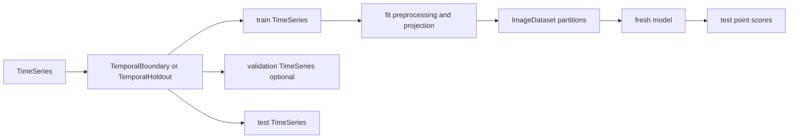

# Design

## Single-Series Contract

One scenario trains and evaluates one fresh model against one temporal sequence.
`TimeSeries` is the direct core input and carries immutable provenance metadata.



`TimeSeries.split(rule)` accepts either a `TemporalBoundary` or a
`TemporalHoldout` and returns a `TimeSeriesSplit`. That split optionally stores
preprocessing and transitions through `WindowedTimeSeriesSplit` to
`ProjectedImageStage`. Preprocessing and projection state is fitted on the
training segment only.

`WindowedTimeSeriesSplit.project(...)` depends only on the lower-level
`WindowProjection` protocol. TS2I projection strategies implement that protocol
and own creation of `ProjectedImageStage`, so the time-series package does not
depend on TS2I.

## Image Datasets

Each `ImageDataset` belongs to exactly one explicit `series_id` and has one
scalar `series_length`. Every `WindowReference` retains its `series_id` for
provenance and must belong to that dataset's series and lie within its length.
Point labels are one direct immutable array aligned with the partition.

Images may remain lazy or be materialized. Folder and ZIP artifacts preserve the
same single-series fields, ordered references, labels, and metadata.

## Scoring

Window evidence is propagated only over the test suffix. Reconstruction point
scores have shape `plan -> propagation -> array`, point labels are one array,
and metric names are `<plan>.<propagation>.<metric>`.

## Reports And Runs

Scenarios construct reports, while callbacks may enrich or publish them.
`detectiv.reports` owns in-memory reports and reconstruction report bundles;
`detectiv.runs` owns execution identity, context, events, output discovery, and
foundational JSON metadata. Reproducibility configuration lives in
`detectiv.reproducibility`. Reports and reproducibility may depend on runs, but
runs does not depend on either. Image dataset artifacts remain under
`detectiv.images.io`.

## TS2I Flow

```python
images = (
    series.split(TemporalBoundary(train_end))
    .preprocess(ConstantFeatureRemoval())
    .preprocess(MinMaxScaling())
    .window(
        train=WindowSpec(64, stride=64, tail=TailPolicy.DROP),
        validation=WindowSpec(64, stride=1, tail=TailPolicy.DROP),
        test=WindowSpec(64, stride=1, tail=TailPolicy.EDGE_PAD),
    )
    .project(
        FixedProjectionStrategy(
            ProjectionScheme(IdentityChannelization())
            .channels(RandomNoise())
            .replicate(n_channels=3)
        )
    )
    .build(ImageSize(height=64, width=64))
)
```

Repeated `preprocess` calls compose in declaration order. Each preprocessor is
fitted on the training output of its predecessor before all partitions are
transformed, matching `PreprocessingPipeline` semantics without test leakage.

`ProjectedImageStage.inspect()` reports shape and point coverage without training.
`ReconstructionScenario.inspect()` reports image counts, scoring plans, and
callbacks. `TorchImageDataset` adapts lazy images to PyTorch data loaders.
