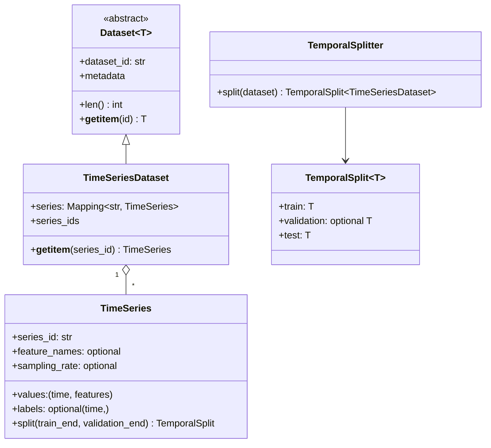
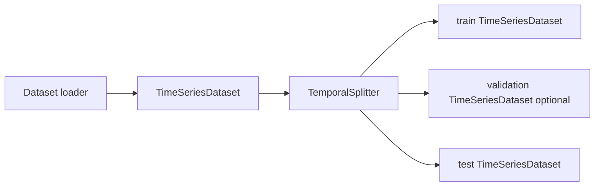
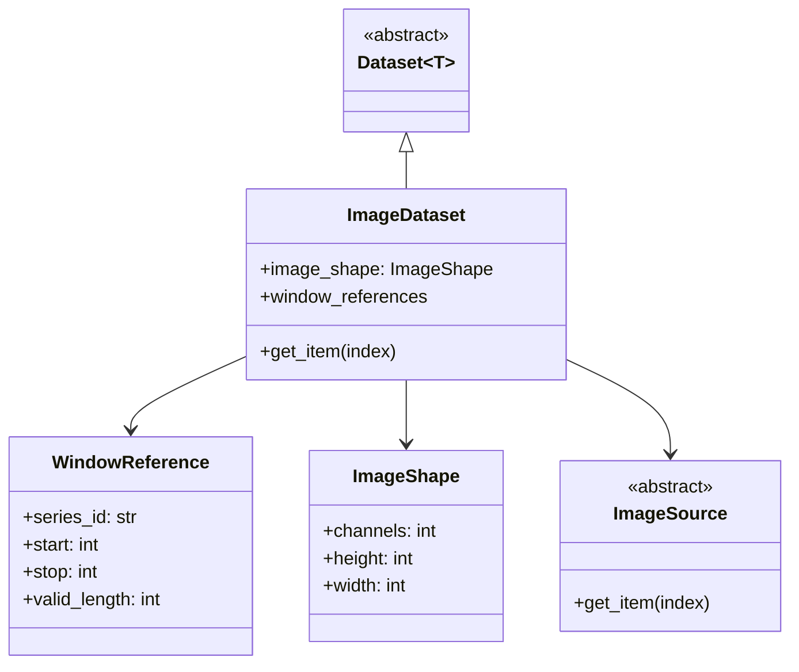

# Design

## Data model





- `TimeSeriesDataset` is a named collection of `TimeSeries`, keyed by stable series IDs.
- Labels remain optional and belong to individual `TimeSeries` objects.
- `TemporalSplit` holds train, optional validation, and test objects of the same type.
- Loaders are adapters that return a `TimeSeriesDataset`.
- `TimeSeries.split()` is a convenience for one series; `TemporalSplitter` handles a full dataset.

## Image datasets



- `ImageDataset` may be lazy; it need not retain every image in memory.
- `WindowReference` preserves the exact source location required for point-score propagation.
- All images in an `ImageDataset` share one `ImageShape` so one detector can process batches safely.
- An `ImageSource` may generate, archive, or load images without changing the dataset API.
- Windows are an internal intermediate computation. They are not a public dataset type.
- `window_labels` are optional image-organization metadata. They are derived from the
  original labels and are never evaluation labels.

## MVP TS2I flow

`dataset` below is a `TimeSeriesDataset`; loaders remain a separate adapter layer.

```python
images = (
    ImagePreparation(dataset)
    .split(TemporalSplitter({"series": TemporalBoundary(train_end)}))
    .window(
        train=WindowSpec(
            64,
            stride=64,
            tail=TailPolicy.DROP,
            labeling_strategy=WindowLabelingStrategy.OR_POOLING,
        ),
        validation=WindowSpec(64, stride=1, tail=TailPolicy.DROP),
        test=WindowSpec(64, stride=1, tail=TailPolicy.EDGE_PAD),
    )
    .project(
        FixedProjectionStrategy(
            ProjectionScheme(Identity()).channels(RandomNoise()).replicate(n_channels=3)
        )
    )
    .build(size=(64, 64))
)
```

`images.train` and `images.test` are lazy `ImageDataset` instances. A future
`TorchImageDataset` adapter will expose them to PyTorch's `DataLoader`.

`WindowLabelingStrategy` controls how optional window metadata is derived:
`OR_POOLING`, `START`, or `END`. It never changes `TimeSeries.labels`; a training
scenario later decides whether those metadata labels are used for supervised,
semi-supervised, or unsupervised training.

`ImageFolderWriter(ImageOutputConfig(path)).write(images)` writes an ordered image
folder plus `manifest.csv`. PNG is the default, matching SPIRAL/ImageFolder usage;
NPY is available for lossless arbitrary-channel output. The manifest is the canonical
order and records each original window location.

The PRISM-style PCA and MSM variants change only the channelization:

```python
projection = FixedProjectionStrategy(
    ProjectionScheme(PCA(n_components=3)).channels(
        RandomNoise(), RandomNoise(), RandomNoise()
    )
)

msm_projection = FixedProjectionStrategy(
    ProjectionScheme(MSM()).channels(RandomNoise(), RandomNoise(), RandomNoise())
)
```
